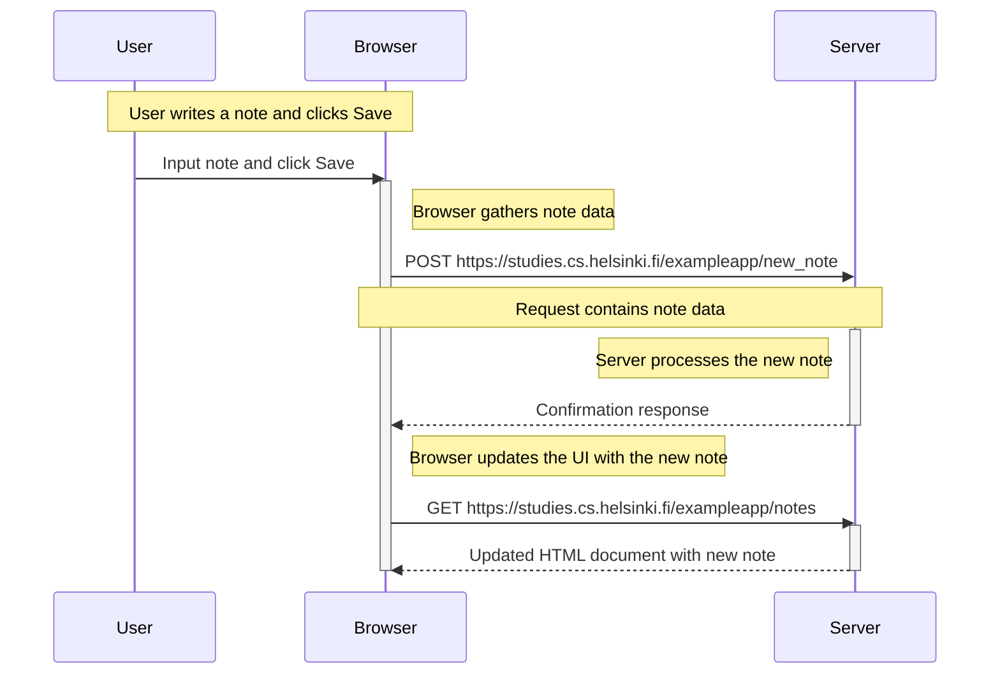

# New Note Driagram

```mermaid
sequenceDiagram
    participant User
    participant Browser
    participant Server

    Note over User, Browser: User writes a note and clicks Save

    User->>Browser: Input note and click Save
    activate Browser
    Note right of Browser: Browser gathers note data

    Browser->>Server: POST https://studies.cs.helsinki.fi/exampleapp/new_note
    Note over Browser, Server: Request contains note data

    activate Server
    Note left of Server: Server processes the new note

    Server-->>Browser: Confirmation response
    deactivate Server

    Note right of Browser: Browser updates the UI with the new note

    Browser->>Server: GET https://studies.cs.helsinki.fi/exampleapp/notes
    activate Server
    Server-->>Browser: Updated HTML document with new note
    deactivate Server

    deactivate Browser
```
