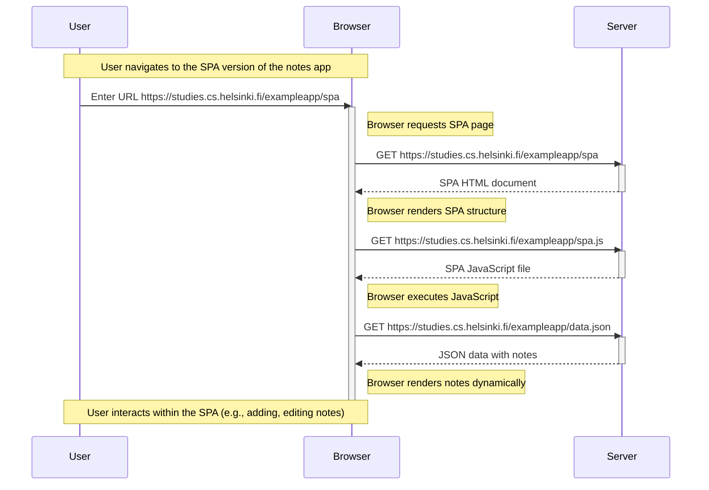

# Single page app diagram

```mermaid
sequenceDiagram
    participant User
    participant Browser
    participant Server

    Note over User, Browser: User navigates to the SPA version of the notes app

    User->>Browser: Enter URL https://studies.cs.helsinki.fi/exampleapp/spa
    activate Browser
    Note right of Browser: Browser requests SPA page

    Browser->>Server: GET https://studies.cs.helsinki.fi/exampleapp/spa
    activate Server
    Server-->>Browser: SPA HTML document
    deactivate Server

    Note right of Browser: Browser renders SPA structure

    Browser->>Server: GET https://studies.cs.helsinki.fi/exampleapp/spa.js
    activate Server
    Server-->>Browser: SPA JavaScript file
    deactivate Server

    Note right of Browser: Browser executes JavaScript

    Browser->>Server: GET https://studies.cs.helsinki.fi/exampleapp/data.json
    activate Server
    Server-->>Browser: JSON data with notes
    deactivate Server

    Note right of Browser: Browser renders notes dynamically

    Note over User, Browser: User interacts within the SPA (e.g., adding, editing notes)

    deactivate Browser
```
